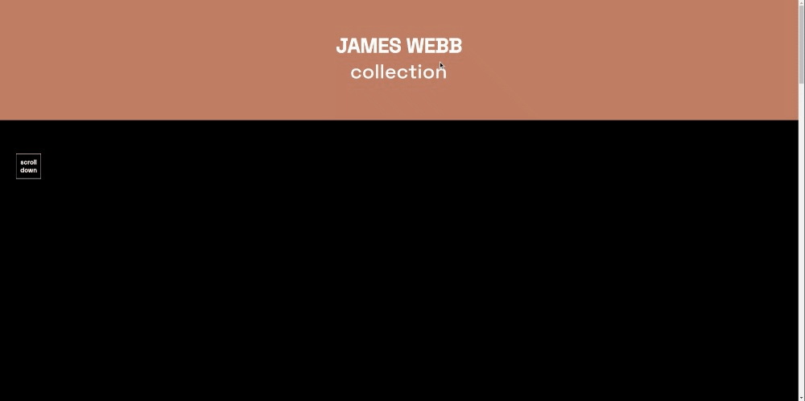

# JAMES WEBB COLLECTION

## **Description**

JAMES WEBB COLLECTION is an animation project developed with REACT JS, using the framer-motion library and styled components,
 where its function is to show some of the first images of what has been JWST and the change of modern astronomy.

## **Installation and Setup Instructions**

### **Example:**

Clone down this repository. You will need `node` and `npm` installed globally on your machine.

Installation:

`npm install`

To Start Server:

`npm start`

To Visit App:

`localhost:3000`

# The project is now ready to be used!!!!!  🚀 #

## DEPENDENCIES +
`framer-motion`
`styled-components`

### **Project Screen Shot(s)**

    
<strong>Header Exemple</strong>

    
      
<strong>Scroll Exemple</strong>

    
      
<strong>Text Exemple</strong>

    
      
<strong>Modal Exemple</strong>

    

